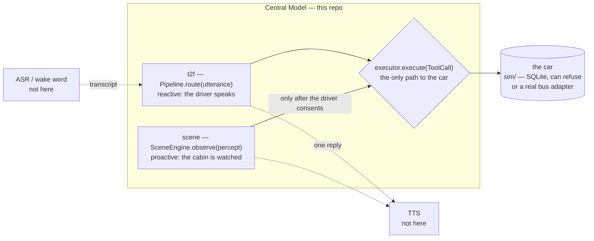
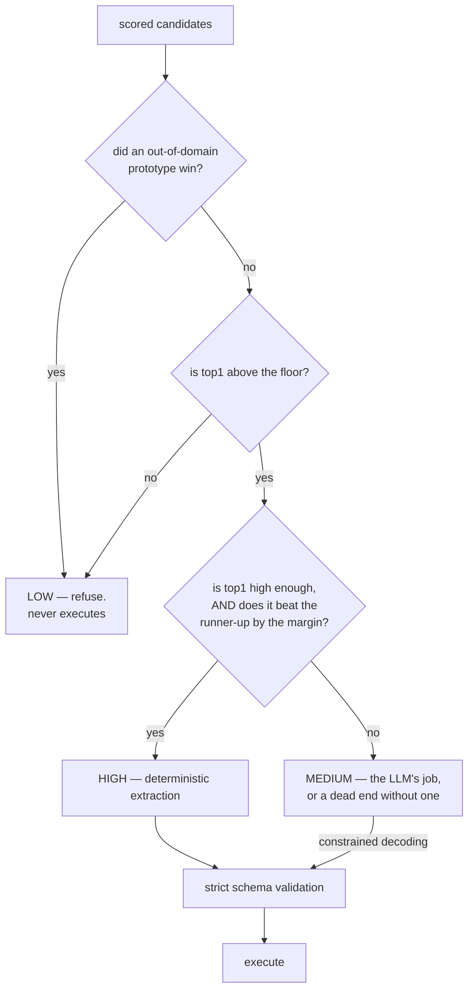
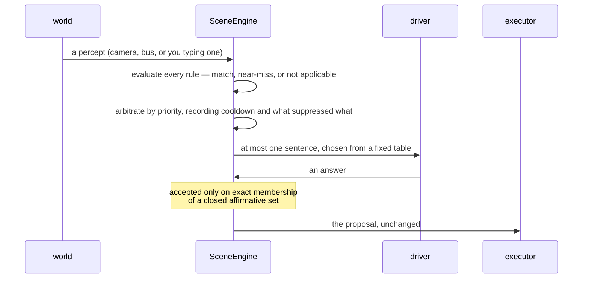
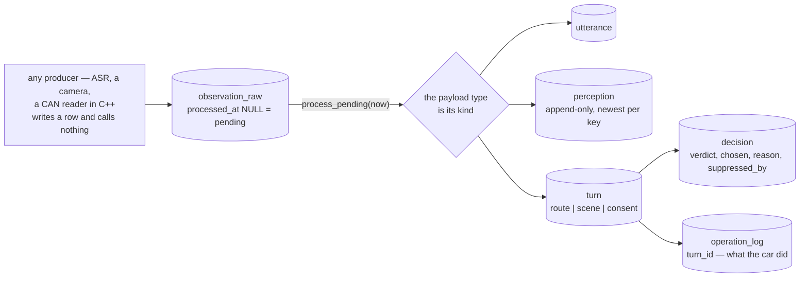
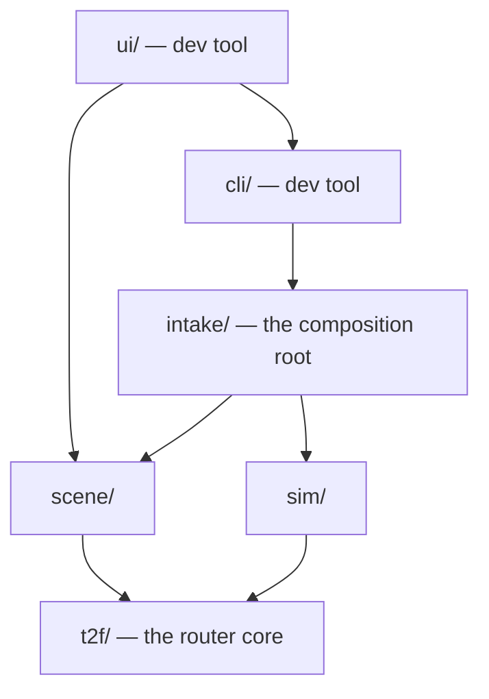

# Central Model — In-Vehicle Text-to-Function Router

**中文版 →** [`docs/OVERVIEW.zh.md`](docs/OVERVIEW.zh.md)

Turns a colloquial **Chinese** in-car utterance into validated vehicle-control function calls,
dispatches them, and returns **one spoken reply**. **Retrieval-first and LLM-optional** — a small LLM
is a fallback, never the primary router. Targets on-device deployment (Qualcomm SA8797,
Qwen3-Embedding-0.6B + Qwen3-0.6B).

## One turn

Captured from a real session — shipped gate, **no LLM**:

```
[C · shipped · S] > 副驾温度调到26度

  recognised   set_temperature{temperature: 26.0, position: passenger}   band=HIGH
  executed     climate.passenger/temperature   24.0 → 26.0
  reply        已将副驾温度设置为26°C。
```

Four things are visible there, and each is a claim the repo defends: the utterance became a
**concrete function with validated parameters**, the gate rated it **confident enough to act**, a row
in the vehicle database **really moved**, and the driver got **one sentence naming what happened**.

## What it is



**Two entry points, one door to the car.** The router answers the driver; the Scene Engine speaks
first when the cabin warrants it. They share no code path and meet only at `executor.execute` — which
is why validation, preconditions, limits and the operation log cannot be bypassed by either.

## What is real, and what is not

| | status |
|---|---|
| ASR, wake word, TTS | **not here** — the Central Model consumes a transcript and returns text |
| the router, the gate, the reply | **real, ships** |
| the LLM fallback | **real, optional** — recommended **off** for a vehicle; see [Which build ships](#which-build-ships) |
| the Scene Engine | **real, ships** — a second entry point, not a router change |
| the car | **simulated** — `sim/` is SQLite behind the same seam a real bus adapter would use |
| the 92-function catalog | a **demonstration** catalog across 10 domains, not a production one |
| on-device (SA8797) | **designed, not built** — no figure here was measured on the target |

## Try it

```bash
python3 -m cli          # terminal; first start loads models (~1 min)
python3 -m ui           # the same session in a browser, on :8770
```

`--fake` starts instantly with no model, but routing is then **meaningless** — it exists to check
plumbing. `--no-llm`, `--gate permissive` and `--db car.sqlite` switch the build, the gate, and
whether the car survives the run. **[Full guide →](docs/TRYING_IT.md)**

### The browser

Takes the CLI's flags minus `--scene-llm`, plus `--port`. Not a second system — `ui/__main__.py`
builds its session through `cli.session`, so anything you can do there you can do here.

```
+-------------------+-------------------+-------------------+
| Perception        | Vehicle           | Rules             |
|  a TTL bar        |  sensed signals,  |  every rule, its  |
|  draining, and    |  their age, and   |  verdict, and     |
|  confidence vs    |  the bus toggle   |  what suppressed  |
|  a rule's bands   |                   |  it               |
|                   +-------------------+                   |
|                   | The car           |                   |
|                   |  what moved,      |                   |
|                   |  flashing         |                   |
+-------------------+-------------------+-------------------+
| Conversation   transcript, pending question, Yes / No     |
+-----------------------------------------------------------+
| The record     heard - decided - did - said. Click a turn.|
+-----------------------------------------------------------+
```

It exists because **a text table cannot show perception decaying** — the page draws the TTL draining
and the confidence sitting *between* a rule's floor and its threshold, so a near-miss reads as a
position rather than two numbers you compare in your head. **Clicking a turn opens it into the rows
it became** (`GET /trace/:id`): here the dataflow and the database are the same object, so the path
an input took *is* a path through five tables, ids and all.

Three things worth knowing:

- **The Yes / No buttons submit the utterances `好` and `不用`** — not a shortcut past the consent
  lexicon. There is one route to the car and the page uses it.
- **What the model *performs* goes through `ACTIONS`** (`observe · say · clock · reset · scene_llm`);
  the simulator's own knobs are a disjoint `CONTROLS` (`set_signal · set_bus`), with a test asserting
  they never overlap. The Vehicle slider writes signals **no function can write** — hence a control,
  not an action.
- **The clock alone cannot make a signal stale.** The page's poll pumps the bus; stop the bus first.

## How a turn is routed

Normalize, segment into spans labelled ACTION or CONTEXT, embed, retrieve by max-sim over multiple
prototypes per card, rescore — then the gate decides what may happen. **Retrieval targets a concrete
function, never a domain**, so a wrong domain guess cannot remove the right function from the pool:



A multi-intent utterance then passes a **plan barrier** — validate the whole plan, execute the valid
subset — and the turn composes **one** reply: confirmations joined, at most one clarification.

**No thresholds are drawn above, deliberately**: the class defaults, the shipped `config.yaml` and
`--gate permissive` are three different triples, so any number would be wrong for two of them. The
shape is what is stable — **both paths reconverge on the same validator**, so attaching the LLM
widens what reaches the validator, never what reaches the car.

**The margin is the interesting clause.** `top1` asks "did anything match?"; the margin asks "did one
thing win?" Over 92 cards with near-twins — `set_screen_brightness` against `set_dashboard_brightness`
— the right function routinely wins by too little to act on. Precision over coverage, deliberately,
and what it costs is [measured][tier].

## The car can say no

`sim/` is a SQLite vehicle behind an injectable `execute(ToolCall) -> ExecResult` seam. **Rows are
signals**, `(entity, attribute)` — not functions — so `open_window` and `set_window_position` move the
same physical window instead of the car holding two contradictory beliefs about it.

```
execute(tool_call)
  |
  +-- not in the catalog? ------------------> refuse: unknown_function
  +-- resolves to no signals? --------------> succeed, logged  (lock_doors, pause_playback)
  +-- device unavailable? ------------------> refuse: {entity} 当前不可用
  +-- precondition unmet? ------------------> refuse: 空调尚未开启。
  +-- outside the signal's physical limits?  refuse: 目标温度只能设置在16到32度之间。
  |     (which may be tighter than the card's: a card says 0-100, a jammed window says 0-60)
  +-- write every signal in one transaction, and log the attempt either way
```

A refusal is the only source of the third failure category — *I tried and the car refused*. The
driver hears the vehicle's own reason and the car is left exactly as it was.

## The proactive half



Three invariants make this safe to leave on. The engine **never authors** what the car says — the
sentence comes from a table, so a rule cannot invent a promise. Consent is **exact set membership**,
never a substring: `好` is a yes, `好像有点热` is not. And a rule that only warns proposes nothing:
`animal_ahead` notifies and stops, because no vehicle function makes an animal in the road safe.

**Silence is the safe default.** A stale signal, a missing model, a failed validation, an exception
mid-evaluation — all degrade to saying nothing, with the reason recorded so the silence can explain
itself.

## The database is the record



`utterance`, `perception` and `turn` are three **siblings** of one raw row, and the deletion rules
say why. A parsed row loses its `raw_id` when retention takes the words (`ON DELETE SET NULL`) but
survives, so a drive stays replayable at the belief level after the transcript is gone. A `decision`
cannot outlive its `turn` (`CASCADE`) — a reason with no turn records something that did not happen.
An `operation_log` row keeps its row and loses only the link: an operation the car really performed
must outlive its explanation.

**Inputs therefore become an interface** — a vision process on another accelerator integrates by
writing a row, not by importing anything — and a run can be asked *why* an hour later.

## Which build ships

`eval/arms.py` builds four configurations and they differ materially in safety. **Arm C
(deterministic, zero LLM) is the recommended candidate build** — the only one in this table with OOD
false-execution and context false-action at 0.000, and the cheapest on the target SoC.

| arm | LLM | OOD false-exec | context false-action | incorrect-exec | P95 |
|---|---|---|---|---|---|
| **C** (recommended) | none | **0.000** | **0.000** | **0.000** | 73 ms |
| C_llm | Qwen3-0.6B on the medium band | 0.321 | 0.857 | 0.285 | ~1085 ms |

> The one table here that restates measured figures, because the recommendation *is* this document's
> thesis and a link cannot carry it. Rates owned by [`TEST_REPORT §5`](docs/TEST_REPORT.md);
> latencies by `RESULTS.md` Spec 4 and Spec 5. **Arm C's row is current; C_llm's predates the
> extractor and negation fixes** — read the gap as a ceiling, not a current reading.

C_llm buys parameter accuracy at a safety cost not acceptable for a vehicle without further work.
Arm D adds a classifier for no measured recall gain and a 184 MB artifact. **Arms S / S_llm are not a
third and fourth candidate** — they score the Scene Engine, which has no path into `Pipeline.route()`,
so attaching or detaching its fallback cannot move any number above.

## Layering



`t2f/` depends on **nothing** — every measured number comes from it, and a dependency on `scene` or
`sim` would make the eval harness a witness to something other than the router. `intake/` is the
composition root and **does not import `t2f`**: it is handed a pipeline, which is how it can be the
root without depending on what it routes to. `ui/` reaches the root through `cli/` — the browser is
the terminal session behind a different door.

`tests/test_layering.py` asserts this rather than trusting the diagram. `eval/` is omitted above: it
may import almost everything, including a documented `research ↔ eval` cycle the test names rather
than hides. `pyproject.toml` ships `t2f eval sim scene intake`; `cli`, `ui` and `research` are
excluded on purpose.

## After Spec 9

Four pieces landed after the numbered specs — three changing how facts reach the system, one changing
what the test suite may claim. All four carry the same proof obligation: arm C and arm S come back
**byte-identical**, so no routing decision and no rule outcome moved.

**Sensed signals.** The car holds signals it *knows* and nothing *commands* — `speed_kph` first. They
declare a `max_age`, past which a signal reads as **absent**, identical to one the car does not hold,
so every condition on it rejects and names both ages. Actuated signals never expire: a window
position holds until commanded otherwise, while a speed is a measurement whose absence means the bus
stopped.

**`intake/` — one door in, one view out.** Every input is one `Input(source, at, payload)` whose
payload type *is* its kind. `WorldView` is a single read-through view over perception **and** the
car, and **owns nothing** — a hub that stored would rebuild the contradictory-beliefs problem
signal-keyed state exists to prevent.

**The store.** The account of a run used to sit in three places, two of which died with the process.
Now every input is a row and every decision lands beside it, so an execution cannot be untraceable —
and a test asserts it. Live on the `:memory:` default; the file-backed vehicle path waits on the
conditions in [TEST_REPORT §13–14](docs/TEST_REPORT.md).

**The model tier.** Every end-to-end test ran on the stand-in embedder, and for the real-catalog
files that was circular: the utterances had been kept **only because the stand-in reached the
function they name**. A suite whose inputs are chosen by the system under test measures the
selection. Those bodies now run again, unchanged, on the real embedder under the shipped weights. Its
value was established by mutation rather than a green run — with the embedder zeroed, **10 of 29
cases still passed** under the default weights and **one** under the shipped ones. [§15][tier] has
the rest.

Design and reasoning: **[sensed signals](docs/superpowers/specs/2026-07-31-sensed-signals-design.md)** ·
**[intake and WorldView](docs/superpowers/specs/2026-08-01-intake-and-worldview-design.md)** ·
**[the store](docs/superpowers/specs/2026-08-02-the-store-design.md)** ·
**[the model tier](docs/superpowers/specs/2026-08-02-the-model-tier-design.md)**.

## Where things live

Nine numbered specs plus four later pieces, each with its own design document. One home per fact:

- [`docs/superpowers/specs/`](docs/superpowers/specs/README.md) — every spec, indexed by what it
  covers and **which of them describe code that exists** (two do not).
- [`docs/TEST_REPORT.md`](docs/TEST_REPORT.md) — **current measured figures**, their denominators, and
  what each does *not* establish. Newest section wins; earlier ones are dated records.
- [`docs/superpowers/RESULTS.md`](docs/superpowers/RESULTS.md) — the per-spec record, written as each
  spec shipped and left as written.
- [`docs/TRYING_IT.md`](docs/TRYING_IT.md) — how to drive it by hand and what to look for.

## Setup & test

Core deps: `numpy pyyaml pytest`. The real models add `transformers torch`; `scikit-learn joblib` are
for the Arm-D classifier and `xgrammar` for constrained decoding. Python ≥ 3.10.

```bash
python3 -m pytest -q            # 1128 selected — no network, no model, ~45 s
python3 -m pytest -m model -q   # the other 74: the e2e suite re-run on the real embedder (needs GPU)
```

**1202 tests, partitioned** — not 1128 plus 74. The default suite routes through `FakeEmbedder`, a
hashed-n-gram stand-in with **no semantics**; the model tier re-runs the end-to-end bodies on the real
embedder under the shipped weights, so those claims are about the router that ships. What that proves,
and what it still does not, is **[TEST_REPORT §15][tier]**.

## Run the evaluation

```bash
# Fast harness sanity check (fake embedder, no model):
python3 -m eval.run_eval --arm C --dataset data/eval/gold.jsonl --fake --permissive

# Real models (calibrate the gate on dev, report on test):
python3 -m eval.run_eval --arm C     --dataset data/eval/gold.jsonl --calibrate
python3 -m eval.run_eval --arm C_llm --dataset data/eval/gold.jsonl --calibrate
python3 -m eval.run_eval --arm D     --dataset data/eval/gold.jsonl --calibrate  # needs
python3 -m research.classify.train --embedding                                   # these first

# The Scene Engine has its own runner and gold file; no embedder on this path:
python3 -m eval.run_scene_eval --arm S        # or --arm S_llm
```

On some boxes a mismatched `torchvision` breaks `sentence-transformers`; the transformers backend
neutralises it (`sys.modules.setdefault("torchvision", None)`, `t2f/embed.py:74`) and is the default.


## Performance posture — read this before quoting a number

Every latency figure in this repository was measured on an **x86 dev machine with a discrete GPU
(CUDA, FP16)**. None was measured on SA8797. Memory is **not measured at all** — no RSS, peak,
cold-start, power, thermal or soak-stability figure exists anywhere. The `<1500 ms` budget the docs
compare against is a self-set engineering inference, not an 87-platform standard.

## Deferred: SA8797 on-device port

Ports via GGUF/llama.cpp on the Hexagon NPU (GBNF replaces xgrammar), plus on-device latency, memory
and crash benchmarking. **Deferred** pending the hardware and the Qualcomm toolchain;
`GgufEmbedder` / `GgufLLMClient` mark the seam and raise `NotImplementedError`. Quantisation
(Q8_0 / Q4_0) is designed, not implemented — both models run FP16 today.

---

*Built with [Claude Code](https://claude.com/claude-code) via iterative brainstorm → spec → TDD plan →
subagent-driven execution → adversarial review cycles. Evaluation numbers are measured, not estimated;
gaps vs. targets are documented with levers rather than hidden.*

[tier]: docs/TEST_REPORT.md#15-update--2026-08-02-later-still-the-model-tier-and-the-circularity-it-removes
