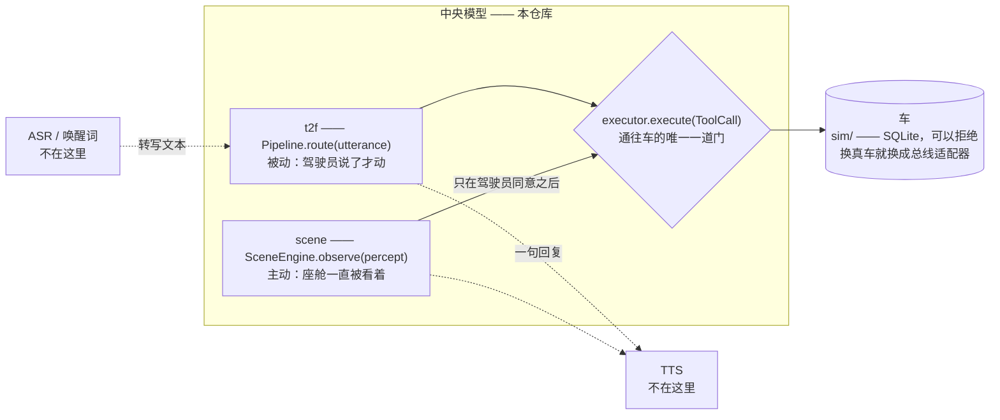
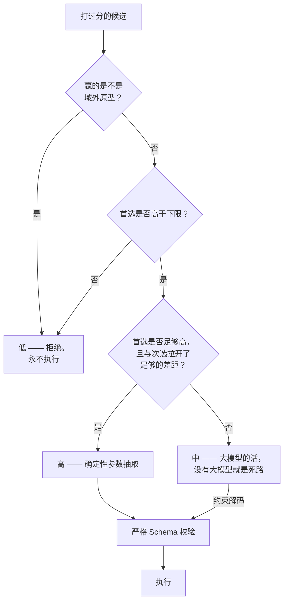
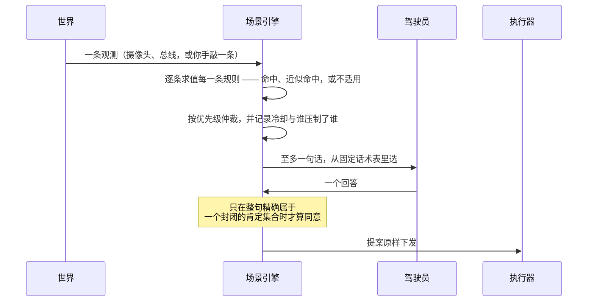
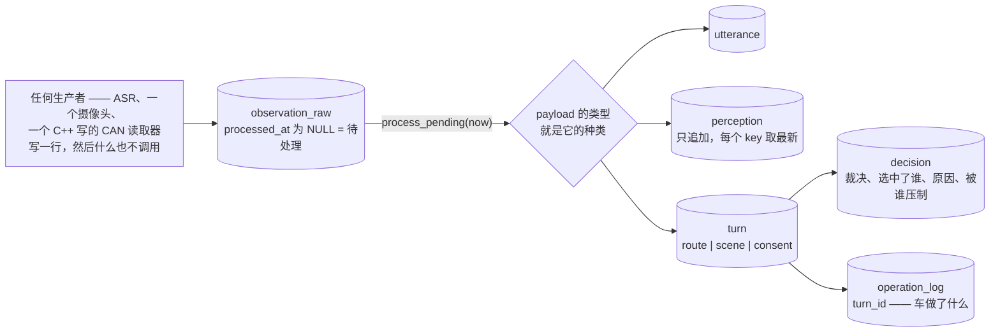
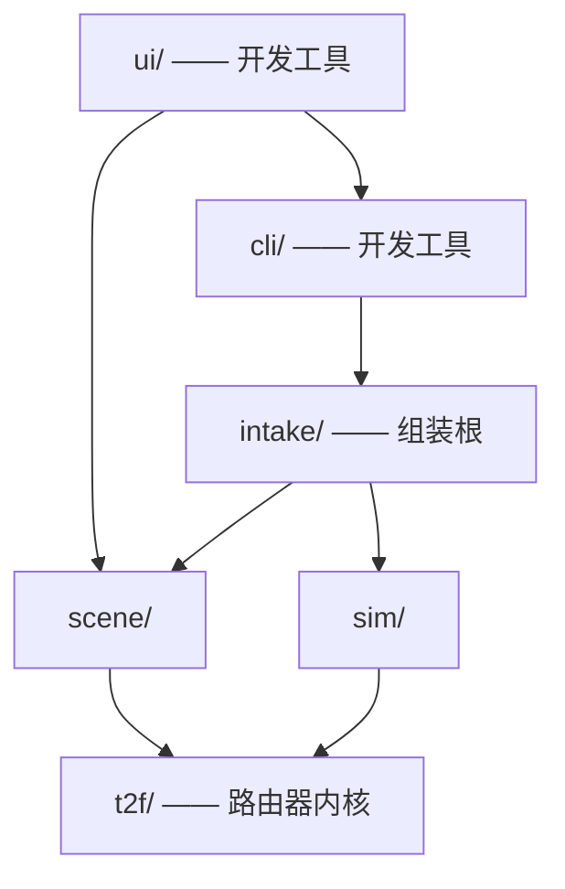

# 中央模型（Central Model）· 车载文本转函数路由器

**English →** [`README.md`](README.md) · **更长的中文系统介绍 →** [`docs/OVERVIEW.zh.md`](docs/OVERVIEW.zh.md)

把一句口语化的**中文**车内指令，变成校验过的车控函数调用，下发执行，并只回**一句话**。
**检索优先、大模型可选**——小模型只在兜底位，从不做主路由。目标是上车部署（高通 SA8797，
Qwen3-Embedding-0.6B + Qwen3-0.6B）。

## 一次交互

截取自一次真实会话——推荐上车配置，**不调用任何大模型**：

```
[C · shipped · S] > 副驾温度调到26度

  recognised   set_temperature{temperature: 26.0, position: passenger}   band=HIGH
  executed     climate.passenger/temperature   24.0 → 26.0
  reply        已将副驾温度设置为26°C。
```

这里有四件事看得见，每一件都是本仓库要守住的主张：一句话变成了**参数经过校验的具体函数**，
置信门判定它**有把握到可以动手**，车辆数据库里**真的有一行动了**，驾驶员得到**一句话，说明发生了什么**。

## 它是什么



**两个入口，通往车只有一道门。** 路由器回答驾驶员；场景引擎在座舱值得开口时先说话。两者不共享任何代码路径，
只在 `executor.execute` 交汇——所以校验、前置条件、物理上限和操作日志，谁也绕不过去。

## 哪些是真的，哪些不是

| | 状态 |
|---|---|
| ASR、唤醒词、TTS | **不在这里**——中央模型吃进一段转写文本，吐出一段文本 |
| 路由器、置信门、播报 | **真实，上车** |
| 大模型兜底 | **真实，可选**——车上建议**关掉**；见[上车的是哪个配置](#上车的是哪个配置) |
| 场景引擎 | **真实，上车**——它是第二个入口，不是对路由器的改动 |
| 车 | **仿真的**——`sim/` 是 SQLite，接缝与真实总线适配器完全一致 |
| 92 个函数的目录 | 跨 10 个域的**演示**目录，不是量产目录 |
| 上车（SA8797） | **设计了，没有做**——本文没有任何一个数字是在目标平台上测的 |

## 试一下

```bash
python3 -m cli          # 终端；首次启动要加载模型（约 1 分钟）
python3 -m ui           # 同一个会话搬进浏览器，端口 :8770
```

`--fake` 不加载模型、瞬间启动，但此时路由结果**毫无意义**——它只用来检查管道是否接通。
`--no-llm`、`--gate permissive` 和 `--db car.sqlite` 分别切换配置、置信门，以及这辆车是否活过这一轮。
**[完整指南 →](docs/TRYING_IT.md)**

### 浏览器界面

它接受命令行的全部参数，去掉 `--scene-llm`，加上 `--port`。它不是第二套系统——`ui/__main__.py`
经由 `cli.session` 组装自己的会话，所以终端里能做的，这里都能做。

```
+-------------------+-------------------+-------------------+
| 感知              | 车况              | 规则              |
|  TTL 进度条在排空 |  感知到的信号、   |  每条规则、它的   |
|  置信度相对规则   |  它们的时龄，     |  裁决，以及是谁   |
|  上下限的位置     |  以及总线开关     |  压制了它         |
|                   +-------------------+                   |
|                   | 车                |                   |
|                   |  什么动了，       |                   |
|                   |  在闪烁           |                   |
+-------------------+-------------------+-------------------+
| 对话      转写、待回答的提问、是 / 否                     |
+-----------------------------------------------------------+
| 记录      听到 - 判定 - 执行 - 说出。点开任意一次交互。   |
+-----------------------------------------------------------+
```

它存在，是因为**一张文本表格画不出感知正在衰减**——页面把 TTL 排空的过程画出来，也把置信度画在规则的
下限与阈值**之间**，于是"就差一点"读起来是一个位置，而不是两个要你在脑子里比大小的数字。
**点开一次交互，它会展开成它变成的那些行**（`GET /trace/:id`）：在这里数据流和数据库是同一个对象，
所以一条输入走过的路径**就是**一条穿过五张表的路径，连 id 都对得上。

三件值得知道的事：

- **"是 / 否"两个按钮提交的是 `好` 和 `不用` 这两句话**——不是绕过同意词表的快捷方式。通往车只有一条路，
  页面走的就是那条。
- **模型能*执行*的东西走 `ACTIONS`**（`observe · say · clock · reset · scene_llm`）；仿真器自己的旋钮
  是互不相交的 `CONTROLS`（`set_signal · set_bus`），并有测试断言两张表永不重叠。车况那一栏的滑杆写的是
  **任何函数都写不了的信号**——所以它是一个控制，不是一个动作。
- **光推时钟没法让信号过期。** 页面的轮询会顺手把总线泵一下；要先停总线。

## 一次交互怎么被路由

归一化，切成标注为「动作」或「背景」的片段，向量化，在每张卡的多个原型上取 max-sim 检索，重排——
然后由置信门决定什么可以发生。**检索命中的是具体函数，从不是域**，所以猜错域也不会把正确的函数从候选池里拿走：



一句话里有多个意图时，还要过一道**计划闸门**——先整体校验，再执行合法的那个子集——并且整次交互只组成
**一句**回复：确认句相连，至多一个提问。

**上图刻意没有画任何阈值**：类默认值、随包发布的 `config.yaml`、`--gate permissive` 是三组不同的三元组，
任何一个数字对另外两组都是错的。稳定的是形状——**两条路径重新汇合到同一个校验器上**，所以挂上大模型拓宽的是
**到达校验器**的东西，从来不是到达车的东西。

**差距（margin）才是那条有意思的判据。** 首选分数问的是"有东西匹配上了吗"；差距问的是"有一样东西赢了吗"。
在 92 张互为近亲的卡片上——`set_screen_brightness` 对 `set_dashboard_brightness`——正确的函数经常赢得
不够多，不足以据此动手。这是刻意的"宁可少做"，代价[被测量过][tier]。

## 车可以说不

`sim/` 是一辆 SQLite 车，藏在可注入的 `execute(ToolCall) -> ExecResult` 接缝后面。**行就是信号**，
`(entity, attribute)`——不是函数——所以 `open_window` 和 `set_window_position` 动的是同一扇物理车窗，
而不是让车对它同时持有两种互相矛盾的信念。

```
execute(tool_call)
  |
  +-- 不在目录里？ --------------------> 拒绝：unknown_function
  +-- 解析不出任何信号？ --------------> 成功，并记账  (lock_doors, pause_playback)
  +-- 设备不可用？ --------------------> 拒绝：{entity} 当前不可用
  +-- 前置条件不满足？ ----------------> 拒绝：空调尚未开启。
  +-- 超出这条信号的物理上限？           拒绝：目标温度只能设置在16到32度之间。
  |     （可能比卡片上的更紧：卡片写 0-100，一扇卡住的车窗只有 0-60）
  +-- 在一个事务里写下每一条信号，无论成败都记一笔日志
```

拒绝是第三类失败——*我试了，车不肯*——的唯一来源。驾驶员听到的是车自己给的理由，而车被原样留在那里。

## 主动的那一半



三条不变量让它可以放心一直开着。引擎**从不撰写**车说的话——句子来自一张表，所以一条规则编不出一句承诺。
同意是**集合精确匹配**，绝不是子串：`好` 是同意，`好像有点热` 不是。而只告知的规则什么也不提案：
`animal_ahead` 只通知，然后停下，因为没有任何车辆功能能让路上的动物变安全。

**沉默是安全默认值。** 过期的信号、缺失的模型、没过的校验、求值中途的异常——全都降级为什么也不说，
并把原因记下来，好让这份沉默能自己解释自己。

## 数据库就是那份记录



`utterance`、`perception` 和 `turn` 是同一条原始行的三个**兄弟**，而删除规则说明了为什么。保留策略把原话
删掉时，解析出来的行会丢掉自己的 `raw_id`（`ON DELETE SET NULL`）但活下来，所以转写没了之后，这趟车程在
信念层面仍然可以重放。一条 `decision` 不能比它的 `turn` 活得更久（`CASCADE`）——没有交互的理由，记录的是
一件没有发生过的事。`operation_log` 的行会留下，只丢掉那条链接：车真的执行过的操作，必须比它的解释活得更久。

**于是输入本身成了一种接口**——跑在另一块加速器上的视觉进程，靠写一行接进来，而不是靠 import 任何东西——
并且一小时之后你还能追问一次运行"为什么"。

## 上车的是哪个配置

`eval/arms.py` 组装出四种配置，它们在安全性上有实质差别。**配置 C（纯确定性、零大模型）是推荐的上车候选**
——它是本表里唯一把闲聊误执行和叙述误动作都压到 0.000 的配置，在目标 SoC 上也最省。

| 配置 | 大模型 | 闲聊误执行 | 叙述误动作 | 错误执行 | P95 |
|---|---|---|---|---|---|
| **C**（推荐） | 无 | **0.000** | **0.000** | **0.000** | 73 ms |
| C_llm | 中置信带上的 Qwen3-0.6B | 0.321 | 0.857 | 0.285 | 约 1085 ms |

> 这是全文唯一一处重述实测数字的表格，因为这份推荐**就是**本文的论点，一条链接扛不动它。比率归
> [`TEST_REPORT §5`](docs/TEST_REPORT.md) 所有；时延归 `RESULTS.md` 的 Spec 4 与 Spec 5。
> **配置 C 那一行是现值；C_llm 那一行早于抽取器与否定修复**——请把这个差距读作上限，而不是当前读数。

C_llm 用不可接受的安全代价换来了参数准确率——对车而言，没有进一步工作之前不能这么换。配置 D 加了一个分类器，
换来 0 召回增益和一个 184 MB 的产物。**配置 S / S_llm 不是第三、第四个候选**——它们打的是场景引擎的分，
而场景引擎没有任何路径通到 `Pipeline.route()`，所以给它挂上或摘掉兜底，都不会让上表里的任何一个数字动一下。

## 分层



`t2f/` **什么都不依赖**——所有实测数字都出自它，而一旦它依赖了 `scene` 或 `sim`，评测框架见证的就不再是
路由器本身。`intake/` 是组装根，并且**不 import `t2f`**：它是被交给一条流水线的，这正是它能当根、却不依赖
自己所路由之物的原因。`ui/` 经由 `cli/` 够到那个根——浏览器就是那个终端会话，只是换了一扇门进去。

`tests/test_layering.py` 断言这件事，而不是信任这张图。上图省略了 `eval/`：它几乎可以 import 一切，
包括一处有据可查的 `research ↔ eval` 环——测试把它点名，而不是把它藏起来。`pyproject.toml` 随包发布
`t2f eval sim scene intake`；`cli`、`ui` 和 `research` 是**故意**排除在外的。

## Spec 9 之后

编号的那些 Spec 之后又落了四件事——三件改变了事实如何抵达系统，一件改变了测试套件可以宣称什么。四件都背着同一条
举证义务：配置 C 与配置 S 的报告必须**逐字节一致**，即没有任何一次路由决策、任何一条规则的结论被挪动过。

**感知类信号。** 车持有一些它**知道**、却没有任何功能能**下发**的量——`speed_kph` 是第一条。它们声明一个
`max_age`，超过之后这条信号读作**不存在**，与这辆车根本不持有它完全一样，于是每一个基于它的条件都拒绝，
并把两个时龄都说出来。可下发的信号永不过期：车窗位置在下一条指令之前一直有效，而车速是一次测量，
它的缺席意味着总线停了。

**`intake/` —— 一道门进来，一个视图出去。** 每一个输入都是一个 `Input(source, at, payload)`，
其 payload 的**类型本身**就是它的种类。`WorldView` 是同时罩住感知观测**和**车况的单一读取视图，
且**自己什么都不存**——一个会存东西的中枢，等于把"以信号为键的状态"当初要消灭的那个"互相矛盾的信念"
问题重新造一遍。

**存储层。** 一次运行的账目过去分散在三个地方，其中两个随进程一起消失。现在每一个输入都是一行，每一次决策
都落在它旁边，于是一次执行不可能无迹可查——并且有测试断言这一点。默认的 `:memory:` 路径已经生效；落盘的
车辆路径还等着 [TEST_REPORT §13–14](docs/TEST_REPORT.md) 里列出的条件。

**模型层测试。** 所有端到端测试此前都跑在替身向量模型上，而对用到真实目录的那些文件来说，这是循环论证：
那些语句当初被留下来，**只因为替身走得到它们指名的那个函数**。一套输入由被测系统挑出来的测试，量的是这次挑选。
那些测试体如今原封不动地，在真实向量模型、上车权重下又跑了一遍。它的价值是用**变异**而不是一次绿灯确立的
——把向量模型置零之后，默认权重下 **29 个用例里仍有 10 个通过**，上车权重下只剩 **1 个**。其余部分见 [§15][tier]。

设计与推理过程：**[感知类信号](docs/superpowers/specs/2026-07-31-sensed-signals-design.md)** ·
**[intake 与 WorldView](docs/superpowers/specs/2026-08-01-intake-and-worldview-design.md)** ·
**[存储层](docs/superpowers/specs/2026-08-02-the-store-design.md)** ·
**[模型层测试](docs/superpowers/specs/2026-08-02-the-model-tier-design.md)**。

## 东西都在哪

九个编号 Spec，加上后来的四件事，每一件都有自己的设计文档。一个事实只有一个归属地：

- [`docs/superpowers/specs/`](docs/superpowers/specs/README.md) —— 全部 Spec，按内容索引，并注明
  **其中哪些描述的是真实存在的代码**（有两个不是）。
- [`docs/TEST_REPORT.md`](docs/TEST_REPORT.md) —— **当前实测数字**、它们的分母，以及每个数字**没有**证明什么。
  最新一节为准；更早的是有日期的记录。
- [`docs/superpowers/RESULTS.md`](docs/superpowers/RESULTS.md) —— 逐 Spec 的记录，随每个 Spec 落地时写下，
  之后原样保留。
- [`docs/TRYING_IT.md`](docs/TRYING_IT.md) —— 怎么亲手开它，以及该看什么。

## 安装与测试

核心依赖：`numpy pyyaml pytest`。真实模型另加 `transformers torch`；`scikit-learn joblib` 用于配置 D 的
分类器，`xgrammar` 用于约束解码。Python ≥ 3.10。

```bash
python3 -m pytest -q            # 选中 1128 条 —— 不联网、不加载模型，约 45 秒
python3 -m pytest -m model -q   # 另外 74 条：端到端套件在真实向量模型上重跑（需要 GPU）
```

**1202 条测试是被切开的**，不是 1128 加 74。默认套件走的是 `FakeEmbedder`——一个基于哈希 n-gram、
**没有任何语义**的替身；模型层则把那些端到端测试体，在真实向量模型和上车权重下重跑一遍，所以那些结论说的是
真正上车的那个路由器。这证明了什么、又仍然没有证明什么，见 **[TEST_REPORT §15][tier]**。

## 跑评测

```bash
# 快速检查框架是否接通（替身向量模型，不加载模型）：
python3 -m eval.run_eval --arm C --dataset data/eval/gold.jsonl --fake --permissive

# 真实模型（在 dev 上标定置信门，在 test 上出报告）：
python3 -m eval.run_eval --arm C     --dataset data/eval/gold.jsonl --calibrate
python3 -m eval.run_eval --arm C_llm --dataset data/eval/gold.jsonl --calibrate
python3 -m eval.run_eval --arm D     --dataset data/eval/gold.jsonl --calibrate  # 需要先
python3 -m research.classify.train --embedding                                   # 跑这一条

# 场景引擎有自己的运行器和标注集；这条路径上没有向量模型：
python3 -m eval.run_scene_eval --arm S        # 或 --arm S_llm
```

在某些机器上，版本不匹配的 `torchvision` 会弄坏 `sentence-transformers`；transformers 后端会把它中和掉
（`sys.modules.setdefault("torchvision", None)`，`t2f/embed.py:74`），并且是默认后端。


## 性能数字的姿态——引用任何一个数字之前先读这段

本仓库里的每一个时延数字，都测于**一台带独立显卡的 x86 开发机（CUDA、FP16）**。**SA8797 上一个都没测过。**
内存**完全没有测**——RSS、峰值、冷启动、功耗、热、长稳，哪儿都没有这些数字。文档里拿来对照的 `<1500 ms`
预算，是一条自设的工程推断，不是 87 平台的标准。

## 待办：SA8797 上车移植

经由 GGUF/llama.cpp 移植到 Hexagon NPU（GBNF 取代 xgrammar），外加上车的时延、内存与崩溃基准。
**待办**，等硬件和高通工具链；`GgufEmbedder` / `GgufLLMClient` 标出了接缝，并抛 `NotImplementedError`。
量化（Q8_0 / Q4_0）设计了、没有实现——今天两个模型都跑 FP16。

---

*用 [Claude Code](https://claude.com/claude-code) 构建，走的是"头脑风暴 → Spec → TDD 计划 → 子智能体执行 →
对抗式评审"的迭代循环。评测数字是测出来的，不是估出来的；与目标的差距连同可用的杠杆一起写明，而不是藏起来。*

[tier]: docs/TEST_REPORT.md#15-update--2026-08-02-later-still-the-model-tier-and-the-circularity-it-removes
