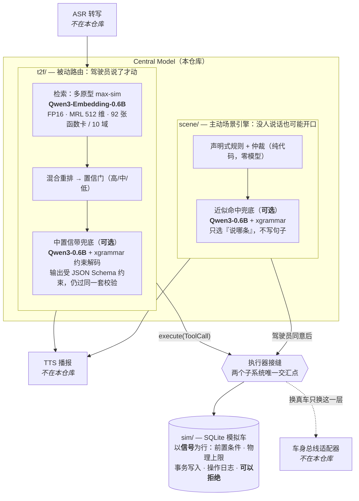
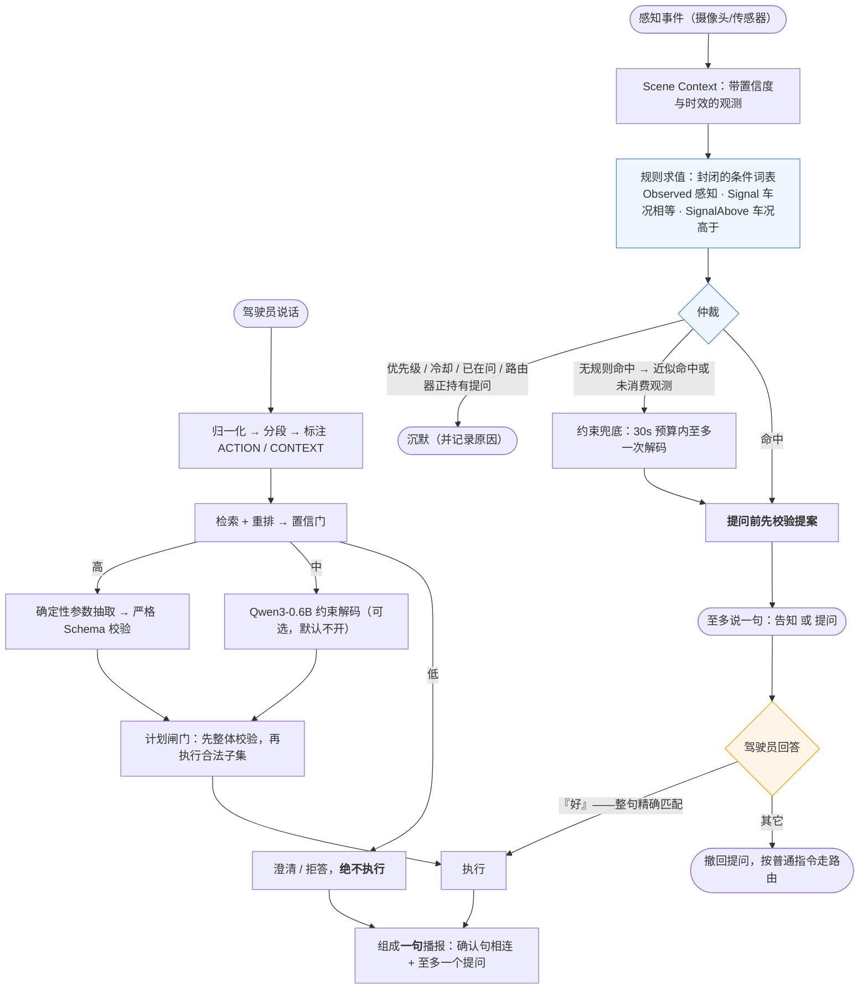

# 中央模型（Central Model）· 系统介绍

> 把一句中文口语指令，变成校验过的车控函数调用，执行，并只回一句话。
> **检索优先、LLM 可选**：小模型只在兜底位，从不做主路由。目标平台高通 SA8797（"87 平台"）。
>
> **速度是这个架构最直接的收益：零 LLM 路径 P50 52 ms / P95 72–84 ms，比挂上 0.6B 兜底快约 14 倍**（开发机数据，见 §3.1）。

---

## 1. 系统结构（含所用模型）

**模型清单**

| 位置 | 模型 | 是否上车 | 说明 |
|---|---|---|---|
| 意图检索（主路径） | **Qwen3-Embedding-0.6B** | 是 | FP16，MRL 截断至 512 维，小目录暴力余弦 |
| 中置信兜底 / 场景兜底 | **Qwen3-0.6B** + xgrammar | **可选**（推荐关闭） | 约束解码，产物走同一严格校验器 |
| 执行置信门（Spec 3） | 逻辑回归 | 否 | 已测量，未接入任何 arm |
| 意图分类器（Arm D） | 字符 n-gram / embedding + LR | 否 | 无召回增益，184 MB，不进车机镜像 |

量化（Q8_0/Q4_0）与 GGUF/llama.cpp 上车口已留接缝，**尚未实现**，当前两个模型都跑 FP16。

---

## 2. 工作流（重点：场景引擎）

**场景引擎（Spec 9）要点** —— 它是路由器**旁边的第二个入口**，不是路由器的改动：

1. **能说，不能做。** 规则命中本身永远不产生 `ToolCall`；车只在 `resolve()` 里、在一个明确的"好"之后动一次。契约测试对**每一条规则**断言这一点。
2. **同意是唯一通路。** "好"必须是归一化后的**整句**（集合精确匹配，非子串），所以一条普通指令永远不会被读成同意。
3. **先校验，再开口。** 提案在提问前就过校验；等驾驶员答应后才发现调用不合法，是"虚假确认"的主动版本。
4. **一切异常降级为沉默。** 异常、缺模型、提案校验失败——没人要求它说话，沉默就是安全默认值。
5. **兜底不写句子。** 模型只在受约束的枚举里选"说哪条场景、用哪句话术"，句子来自固定话术表；`execute` 根本不在决策词表里。
6. **沉默会解释自己。** 每次观测都记录逐规则的裁决与被谁压制（冷却剩余、被更高优先级压过、路由器正持有提问），CLI/浏览器可见。

场景发起的调用与驾驶员发起的调用走**同一个**校验、前置条件、物理上限和操作日志。

> 条件形式是**封闭词表**（`Observed` / `Signal` / `SignalAbove`），这正是契约测试能遍历全部规则并对每条断言性质的前提；"车速高于 x"是加一种形状，而不是给条件加表达式。出厂规则集现为 2 条：后排有儿童且车窗儿童锁未开（提问），以及前方有动物且车辆行驶中（**只告知，不提案**——没有任何车辆功能能让路上的动物变安全）。
>
> 第二条规则也让**仲裁**第一次有了真正可仲裁的东西：动物告警优先级高于儿童锁提问，被压过的那条会如实报告 `outranked by animal_ahead`，且不消耗自己的冷却。
>
> **车速是车况信号，不是感知观测。** 它属于新增的"**感知类信号**"——车**知道**但没有任何功能能**下发**的量（`sim/seed.py` 的 `_SENSED`）。因此仿真车第一次持有一条没有任何功能卡片能写的行；种子守卫因此从"恰好等于可写信号"拓宽为"可写信号 **加上** 已声明的感知类信号"，两个方向仍然都被断言。用 `/signal vehicle.all/speed_kph=45` 设置——这是**仿真器控制**，不是中央模型的动作，代码里放在与 `ACTIONS` 互斥的 `CONTROLS` 表内。

---

## 3. 已测试验证的性能

**自动化测试：全绿。** `python3 -m pytest -q` → **761 passed · 0 failed · 0 xfailed**（另有 1 条 skip：只告知的规则没有提案可校验；5 条需 GPU 的模型测试被 deselect。2026-07-31 实测于 HEAD `7578a79`）。红牌用例 11 → 9 → 1 → **0**，全部是 `xfail(strict=True)`，补上即自曝。其中 131 条为端到端用例（同时断言"下发了什么"与"驾驶员听到什么"）。

### 3.1 速度性能（重点）

一次交互的端到端时延，真实模型、gold 数据集全量跑出来的分位数（**不含 ASR / TTS**）：

| 配置 | P50 | P95 | 每请求 LLM 调用 | 读法 |
|---|---|---|---|---|
| **Arm C — 零 LLM（推荐上车）** | **52 ms** | **72 – 84 ms** | **0.000** | 跨 Spec 1/4/5/6 多次记录：72 / 73 / 71.7→75.6 / 78.4→83.9，差异是运行噪声而非改动 |
| Arm C_llm — 中置信带走 0.6B | 835 ms | 1019 – 1184 ms | 1.16 | **约 14× 慢**；多次记录 1019 / 1085 / 1092 / 1126 / 1184 |
| Arm D — +监督分类器 | 932 ms | 1390 ms | 1.11 | 最慢，且无召回增益、多 184 MB 产物 |
| Spec 3 学习置信门"安全点"（**未上车**） | — | ~275 ms | 0.000 | 研究结果，未接入任何 arm |
| 自设工程预算 | — | < 1500 ms | — | **自设推断，不是 87 平台标准** |

**为什么快**：主路径上**没有任何解码**——一次 Qwen3-Embedding-0.6B 前向（MRL 截断到 512 维）＋ 92 张卡上的暴力余弦 ＋ 规则参数抽取，全是确定性代码；只有落进中置信带才会唤醒 0.6B，而推荐配置根本不唤醒它（`avg_llm_calls_single` = **0.000**）。这也是"检索优先、LLM 可选"在时延上的全部含义：**把 LLM 从主路径上拿掉，P95 直接从 ~1.1 s 掉到 ~75 ms。**

**场景引擎侧**：规则求值是纯代码，实测每事件 **0.0000 次**模型调用（Arm S），因此不承担任何解码时延；挂上兜底后是 0.1538 次/事件，且受 30 秒预算约束、至多一次解码。**但场景路径没有单独的时延测量数字**——上表四行量的都是路由器。

**这些数字的边界**：全部测于 **x86 开发机 + 独立显卡（CUDA / FP16）**，**SA8797 上一个数都没有测过**；内存、冷启动、功耗、热与长稳**完全未测**；量化（Q8_0/Q4_0）与 GGUF/llama.cpp 上车口尚未实现。所以上表是"这个架构在什么量级"的证据，不是车机上的验收数据。

### 3.2 准确率与安全性

**路由（Arm C，零 LLM，真实 embedder，gold 测试集 n=192）**

| 指标 | 数值 | 读法 |
|---|---|---|
| recall@1 | **0.8644** | 单意图首选命中 |
| 多意图集合召回 | **0.8194** | 一句多指令 |
| OOD 误执行 / 上下文误动作 | **0.0000** | 闲聊与叙述不会动车 |
| 错误执行率 | **0.0000** | 原 0.0312 |
| 无效值不下发 | **1.0000**（22） | 校验不过的值一次也没到车 |
| 参数精确匹配 | 0.4133 | 原 0.2733 |
| 端到端确定性成功 | 0.1333 | 见下方读数须知 |
| P95 延迟 | **73 ms** | 见 §3.1，本次记录值；跨重跑区间 72–84 ms |

**播报契约（每次评测强制）**：`reply_nonempty` / `reply_action_coverage` / `reply_single_question` 全部 **1.0000** —— 无静默路径、无静默执行、无论几个子句失败都只问一个问题；失败原因覆盖率 `reply_cause_coverage` **1.0000**（15 条标注）。

**不变量是本仓库最硬的结论**：5 条契约在 **382 行数据 × 6 种配置**（健康车/拒绝车/中置信阈值/全低阈值/快照初态/空拒绝详情）下**零违反**，且每条都用**变异测试**证明过会报警（把回复固定成"好的。"、伪造一句确认、丢掉最后一句确认……都被抓住）。下发内容读自**车自己的操作日志**，而非 `RouteResult`——忘记上报的执行藏不住。

**场景引擎（13 行手写场景 gold）**

| 指标 | Arm S（纯规则） | Arm S_llm（+兜底） | n |
|---|---|---|---|
| 误开口率 | **0.0000** | **0.0000** | 9 |
| 场景召回 | **1.0000** | **1.0000** | 4 |
| 误同意率 | **0.0000** | **0.0000** | 4 |
| 每事件 LLM 调用 | **0.0000** | 0.1538 | 13 |

Arm S 已在**两条规则**下于 2026-07-31 重跑，四项指标一字未动（报告文件与上一次字节一致）；Arm S_llm 一列测于 2026-07-30、当时规则集只有一条，**尚未重测**。

**为什么推荐 Arm C（零 LLM）上车**：Arm C_llm 用参数准确率（0.72 vs 0.41）换来了 OOD 误执行 0.321、上下文误动作 0.857、错误执行 0.285 与 ~1085 ms P95——对车而言不可接受。（C_llm 这一行早于抽取器与否定修复，未重测，应读作差距上限而非现值。）

---

## 4. 读数须知

- **端到端 0.1333 不等于"能力只有 13%"。** 主要卡在出厂阈值下大量**识别正确**的语句落在中置信带而零 LLM 臂不执行（top1 0.74–0.80 但差值不足），这是刻意的"宁可不做"取舍，可用阈值换覆盖率。
- **`reply_exact_match` 0.0811 量的是措辞不是能力**：37 条标注是实现之前手写的自由中文，故另加 `reply_cause_coverage`（量事实是否说到）= 1.0000。
- **场景 gold 是手写的**：编码的是"我们相信摄像头会报什么"，仓库里没有摄像头、没有视觉模型、没有真实座舱数据；`scene_recall 1.000` 是穿着指标外衣的契约测试。分母只有 4 和 9。
- **所有延迟均为开发机数据，SA8797 上一个数都没测**，内存/冷启动/功耗/长稳完全未测——边界见 §3.1。
- **没有 ASR、没有 TTS、没有真车**——执行侧全部是 SQLite 模拟车。

详见 [`README.md`](../README.md) · [`docs/TEST_REPORT.md`](TEST_REPORT.md) · [`docs/superpowers/RESULTS.md`](superpowers/RESULTS.md)
