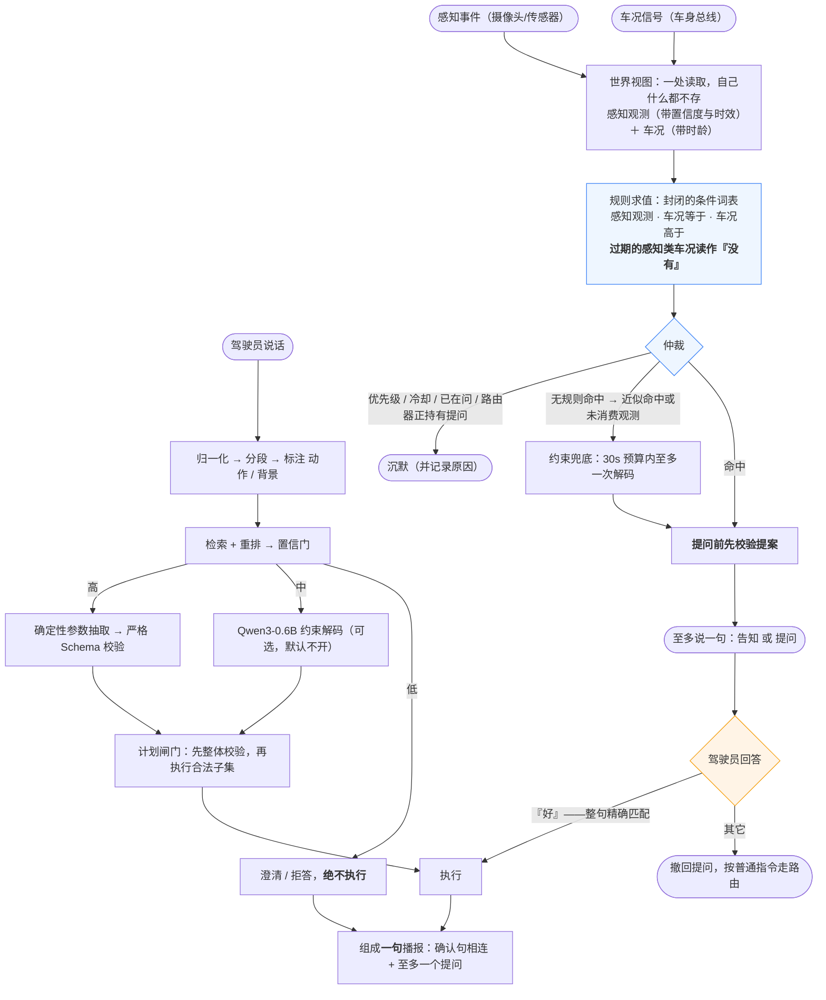

# 中央模型（Central Model）· 系统介绍

> 把一句中文口语指令，变成校验过的车控函数调用，执行，并只回一句话。
> **检索优先、大模型可选**：小模型只在兜底位，从不做主路由。目标平台高通 SA8797（"87 平台"）。
>
> **速度是这个架构最直接的收益：推荐配置一次交互约 50–85 毫秒，比挂上 0.6B 兜底快约 14 倍**（开发机数据，见 §3.1）。

---

## 1. 系统结构（含所用模型）

```mermaid
flowchart TB
    ASR["ASR 转写<br/><i>不在本仓库</i>"] --> T2F
    subgraph CM["Central Model（本仓库）"]
        direction TB
        subgraph T2F["被动路由：驾驶员说了才动"]
            direction TB
            E["检索：多原型 max-sim<br/><b>Qwen3-Embedding-0.6B</b><br/>FP16 · MRL 512 维 · 92 张函数卡 / 10 域"]
            G["混合重排 → 置信门（高/中/低）"]
            L["中置信带兜底（<b>可选</b>）<br/><b>Qwen3-0.6B</b> + xgrammar 约束解码<br/>输出受 JSON Schema 约束，仍过同一套校验"]
            E --> G --> L
        end
        subgraph SC["主动场景引擎：没人说话也可能开口"]
            direction TB
            R["声明式规则 + 仲裁（纯代码，零模型）"]
            F["近似命中兜底（<b>可选</b>）<br/><b>Qwen3-0.6B</b> + xgrammar<br/>只选『说哪条』，不写句子"]
            R --> F
        end
    end
    T2F --> TTS["TTS 播报<br/><i>不在本仓库</i>"]
    SC --> TTS
    T2F -->|"下发车控调用"| SEAM{{"执行器接缝<br/>两个子系统唯一交汇点"}}
    SC -->|"驾驶员同意后"| SEAM
    SEAM --> SIM[("SQLite 模拟车<br/>以<b>信号</b>为行：前置条件 · 物理上限<br/>事务写入 · 操作日志 · <b>可以拒绝</b>")]
    SEAM -.->|"换真车只换这一层"| BUS["车身总线适配器<br/><i>不在本仓库</i>"]
```

**模型清单**

| 位置 | 模型 | 是否上车 | 说明 |
|---|---|---|---|
| 意图检索（主路径） | **Qwen3-Embedding-0.6B** | 是 | FP16，MRL 截断至 512 维，小目录暴力余弦 |
| 中置信兜底 / 场景兜底 | **Qwen3-0.6B** + xgrammar | **可选**（推荐关闭） | 约束解码，产物走同一严格校验器 |
| 执行置信门 | 逻辑回归 | 否 | 已测量，未接入产品链路 |
| 意图分类器 | 字符 n-gram / 向量 + 逻辑回归 | 否 | 无召回增益，184 MB，不进车机镜像 |

量化（Q8_0/Q4_0）与 GGUF/llama.cpp 上车口已留接缝，**尚未实现**，当前两个模型都跑 FP16。

---

## 2. 工作流（重点：场景引擎）

**场景引擎要点** —— 它是路由器**旁边的第二个入口**，不是路由器的改动：

1. **能说，不能做。** 规则命中本身永远不产生车控调用；车只在一句明确的"好"之后动一次。契约测试对**每一条规则**断言这一点。
2. **同意是唯一通路。** "好"必须是归一化后的**整句**（集合精确匹配，非子串），所以一条普通指令永远不会被读成同意。
3. **先校验，再开口。** 提案在提问前就过校验；等驾驶员答应后才发现调用不合法，是"虚假确认"的主动版本。
4. **一切异常降级为沉默。** 异常、缺模型、提案校验失败——没人要求它说话，沉默就是安全默认值。
5. **兜底不写句子。** 模型只在受约束的枚举里选"说哪条场景、用哪句话术"，句子来自固定话术表；"执行"根本不在它的决策词表里。
6. **沉默会解释自己。** 每次观测都记录逐规则的裁决与被谁压制（冷却剩余、被更高优先级压过、路由器正持有提问），终端与浏览器都可见。

场景发起的调用与驾驶员发起的调用走**同一个**校验、前置条件、物理上限和操作日志。

**在输入侧，现在也只有一道门。** 语音文本、感知观测、车况信号过去各有各的入口和各自的纪律，现在统一成一个信封——**来源 · 时刻 · 内容**。内容的**类型本身**就是种类，所以没有一个额外的"种类"字段可以和内容互相矛盾；而每个来源只能产出它声明过的东西，"摄像头"再也发不出一条车况写入。规则读到的是上图那个**世界视图**：它同时看得见感知观测和车况，但**自己什么都不存**——它一旦存了，车和它就可能对同一把儿童锁给出两种说法，而这正是"以信号为行"当初要消灭的问题。这道门是**随包发布**的，此前把路由器、场景引擎和模拟车装配在一起的代码只存在于命令行工具里，而那个工具本来就不打包。

> 条件形式是**封闭词表**（感知观测 / 车况等于 / 车况高于），这正是契约测试能遍历全部规则并对每条断言性质的前提；"车速高于 x"是加一种形状，而不是给条件加表达式。出厂规则集现为 2 条：后排有儿童且车窗儿童锁未开（提问），以及前方有动物且车辆行驶中（**只告知，不提案**——没有任何车辆功能能让路上的动物变安全）。
>
> 第二条规则也让**仲裁**第一次有了真正可仲裁的东西：动物告警优先级高于儿童锁提问，被压过的那条会如实报告"被动物告警压过"，且不消耗自己的冷却。
>
> **车速是车况信号，不是感知观测。** 它属于新增的"**感知类信号**"——车**知道**但没有任何功能能**下发**的量。因此仿真车第一次持有一条没有任何功能卡片能写的行；种子守卫也随之从"恰好等于可写信号"拓宽为"可写信号 **加上** 已声明的感知类信号"，两个方向仍然都被断言。它由一条独立的**仿真器控制**指令设置（`/signal vehicle.all/speed_kph=45`），与中央模型的动作分属两张互不相交的表——告诉仿真器"车正在跑 45"是**世界在变**，不是有人在命令车。
>
> **感知类信号会过期。** 每条都自带一个**最大时龄**（车速 2.0 秒），超过之后它读作**没有**——与"这辆车根本不持有这条信号"完全一样——于是所有条件都拒绝，引擎沉默，并把**两个时龄都说出来**（`vehicle.all/speed_kph is stale (40.0s > 2.0s)`）。在此之前，写信号时记的那个时刻从 Spec 7 起一直在写、却**没有任何地方读**：总线断了和车停着，对每一条规则来说无法区分，动物告警会照样对着十分钟前冻结的车速开口。感知观测早就有这套纪律，车况一直没有。
>
> **可下发的信号永远不过期，这个不对称正是重点。** 车窗位置在没人下发新指令之前一直有效；车速是连续测量，它的缺席意味着总线停了。所以"最大时龄"只长在感知类信号上，而且声明在**信号**上、不在规则上——**没有哪条新规则会忘记去问**。总线本身是被逐次"泵"出来的，不是后台线程（SQLite 的线程亲和性逼出这个选择；后台线程还不会报错，只会让浏览器画出一辆空车）。落下来的语义反而是对的：总线活着的时候，你什么时候看它都是新鲜的；`/bus off` 停泵，时龄才开始累积。

---

## 3. 已测试验证的性能

**自动化测试：全绿。** `python3 -m pytest -q` → **860 passed · 0 failed · 0 xfailed**（另有 1 条 skip：只告知的规则没有提案可校验；5 条需 GPU 的模型测试被 deselect。2026-08-01 实测于当前 HEAD）。红牌用例 11 → 9 → 1 → **0**，且全部是"修好即自曝"的严格预期失败。其中 131 条为端到端用例（同时断言"下发了什么"与"驾驶员听到什么"）。逐项数字见 [`docs/TEST_REPORT.md`](TEST_REPORT.md)，那里是本仓库当前实测数字的唯一维护处。

### 3.1 速度性能（重点）

从收到一句话到给出答复的耗时，真实模型、全量测试集实测（**不含 ASR / TTS**）。区间是"常见情况 → 偏慢的那部分请求"：

| 配置 | 一次交互耗时 | 每请求模型调用 | 读法 |
|---|---|---|---|
| **推荐配置：主路径不调用任何大模型** | **约 50 – 85 毫秒** | **0.000** | 四个开发阶段多次重跑都落在这个区间，差异是运行噪声而非改动 |
| 中置信带交给 0.6B 兜底 | 约 0.8 – 1.2 秒 | 1.16 | **约 14× 慢**，五次记录都在这个区间 |
| 再加一个监督分类器 | 约 0.9 – 1.4 秒 | 1.11 | 最慢，且无召回增益、多 184 MB 产物 |
| 学习式置信门的"安全点"（**未上车**） | 约 0.3 秒 | 0.000 | 研究结果，未进入产品链路 |
| 自设工程预算 | < 1.5 秒 | — | **自设推断，不是 87 平台标准** |

**为什么快**：主路径上**没有任何解码**——一次 Qwen3-Embedding-0.6B 前向（MRL 截断到 512 维）＋ 92 张卡上的暴力余弦 ＋ 规则参数抽取，全是确定性代码；只有落进中置信带才会唤醒 0.6B，而推荐配置根本不唤醒它（每请求模型调用 **0.000**）。这也是"检索优先、大模型可选"在时延上的全部含义：**把大模型从主路径上拿掉，一次交互从约 1 秒掉到 100 毫秒以内。**

**场景引擎侧**：规则求值是纯代码，实测每事件 **0.0000 次**模型调用，因此不承担任何解码时延；挂上兜底后是 0.1538 次/事件，且受 30 秒预算约束、至多一次解码。**但场景路径没有单独的时延测量数字**——上表量的都是语音指令路由。

**这些数字的边界**：全部测于 **x86 开发机 + 独立显卡（CUDA / FP16）**，**SA8797 上一个数都没有测过**；内存、冷启动、功耗、热与长稳**完全未测**；量化与 GGUF/llama.cpp 上车口尚未实现。所以上表是"这个架构在什么量级"的证据，不是车机上的验收数据。

### 3.2 准确率与安全性

**语音指令路由**（推荐配置，主路径零大模型，真实向量模型，人工核对测试集 n=192）

| 指标 | 数值 | 读法 |
|---|---|---|
| 首选命中率 | **0.8644** | 单意图取回正确函数 |
| 多意图集合召回 | **0.8194** | 一句话里多条指令 |
| 闲聊误执行 / 叙述误动作 | **0.0000** | 不是指令的话不会动车 |
| 错误执行率 | **0.0000** | 原 0.0312 |
| 无效值不下发 | **1.0000**（22） | 校验不过的值一次也没到车 |
| 参数精确匹配 | 0.4133 | 原 0.2733 |
| 端到端确定性成功 | 0.1333 | 见下方读数须知 |
| 一次交互耗时 | **约 50 – 85 毫秒** | 见 §3.1 |

**播报契约（每次评测强制）**：无静默路径、无静默执行、无论几个子句失败都只问一个问题——三项全部 **1.0000**；失败原因覆盖率 **1.0000**（15 条标注）。

**不变量是本仓库最硬的结论**：5 条契约在 **382 行数据 × 6 种配置**（健康车/拒绝车/中置信阈值/全低阈值/快照初态/空拒绝详情）下**零违反**，且每条都用**变异测试**证明过会报警（把回复固定成"好的。"、伪造一句确认、丢掉最后一句确认……都被抓住）。下发内容读自**车自己的操作日志**，而不是系统自己的返回值——忘记上报的执行藏不住。

**场景引擎**（20 行手写场景数据）

| 指标 | 纯规则 | 纯规则 + 兜底 | n |
|---|---|---|---|
| 误开口率 | **0.0000** | **0.0000** | 15 |
| 场景召回 | **1.0000** | **1.0000** | 5 |
| 误同意率 | **0.0000** | **0.0000** | 4 |
| 每事件模型调用 | **0.0000** | 0.1538 | 20 |

纯规则一列已在**两条规则**下、并在统一入口与世界视图改造之后于 2026-08-01 再次重跑，四项指标一字未动（报告文件与上一次字节一致）——这正是那次改造的验收条件：规则该怎么判还怎么判，动的只是底下的管道。带兜底一列测于 2026-07-30、当时规则集只有一条，**尚未重测**。

场景数据同日从 13 行补到 **20 行**：此前规则集翻倍而数据没有跟上，"前方有动物"那条规则在**测量一栏里没有任何覆盖**——它只有单元测试和契约巡检兜着。补的七行里，有一行是这套系统里**唯一**会让指标变动的时效性用例（车速设好、总线停掉、时钟推过 max_age），在此之前"信号会过期"这件事有测试、没有度量。四项指标一字未动，只是分母变了。数据仍然是手写的：多写七行，也只是多七条我们自己的信念。

**为什么推荐主路径不挂大模型**：挂上 0.6B 后，参数准确率从 0.41 提到 0.72，代价是闲聊误执行 0.321、叙述误动作 0.857、错误执行 0.285，外加慢一个数量级——对车而言不可接受。（这一组数字早于抽取器与否定修复，未重测，应读作差距上限而非现值。）

---

## 4. 读数须知

- **端到端 0.1333 不等于"能力只有 13%"。** 主要卡在出厂阈值下大量**识别正确**的语句落在中置信带，而不挂大模型的配置不执行中置信带（首选相似度 0.74–0.80 但与次选差距不足），这是刻意的"宁可不做"取舍，可用阈值换覆盖率。
- **回复逐字匹配率 0.0811 量的是措辞不是能力**：37 条标注是实现之前手写的自由中文，故另加"失败原因覆盖率"（量事实是否说到）= 1.0000。
- **场景数据是手写的**：编码的是"我们相信摄像头会报什么"，仓库里没有摄像头、没有视觉模型、没有真实座舱数据；场景召回 1.000 是穿着指标外衣的契约测试。分母只有 4 和 9。规则集翻了一倍，这 13 行却一行没加——**动物告警在实测那一列里没有任何一行数据**，它只被单元测试和契约遍历覆盖。这是刻意的：没有为了稳住某个数字去动手写数据。
- **"最大时龄 2.0 秒"是拍的**：没有任何测量支撑它，只是一个 10Hz 信号的合理值。它是一处声明里的一个常数，应当按暂定值读。
- **所有延迟均为开发机数据，SA8797 上一个数都没测**，内存/冷启动/功耗/长稳完全未测——边界见 §3.1。
- **没有 ASR、没有 TTS、没有真车**——执行侧全部是 SQLite 模拟车。

详见 [`README.md`](../README.md) · [`docs/TEST_REPORT.md`](TEST_REPORT.md) · [`docs/superpowers/RESULTS.md`](superpowers/RESULTS.md)
