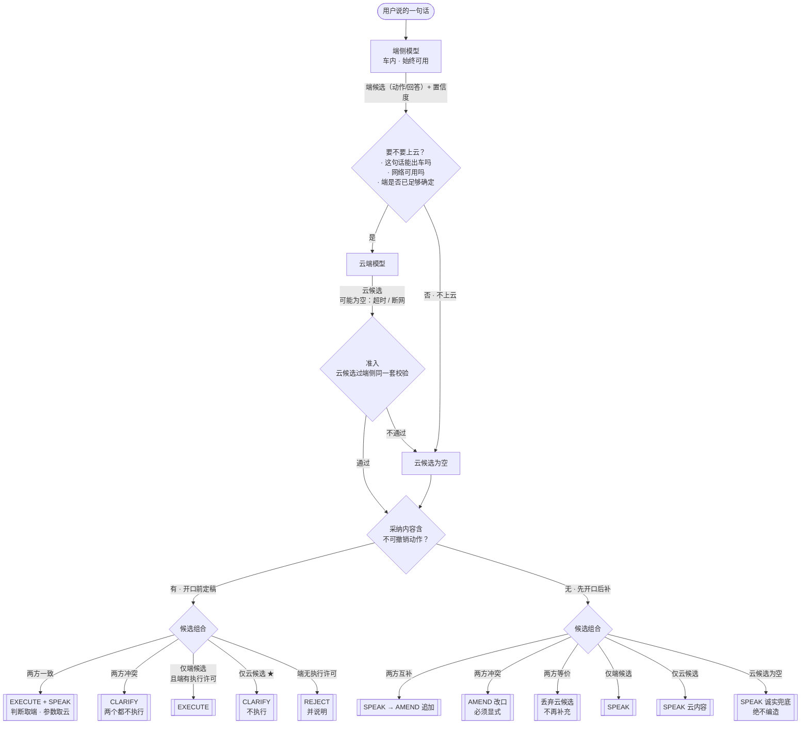

# 端云仲裁逻辑图 · 设计说明

**日期：** 2026-07-26
**产出：** 一张端云仲裁总图 + 作为读图说明的分析。**不含实现计划**——本文不改动任何代码。

> 本文只画**仲裁逻辑**。ASR、分词、检索、执行、播报等链路环节一律不画；它们在图上只以"用户文本进来、裁决出去"两个接口出现。

---

## 1. 这张图要回答的问题

端云结合的系统里，一次用户输入可能得到两份处理方案——车内小模型一份，云端大模型一份。**最终听谁的？**

这张图就是那个判断过程。它的核心不是"怎么分流"，而是**两份方案摆在面前时如何裁决**，以及**云那份缺席时怎么办**（缺席是常态，不是异常）。

---

## 2. 术语

图上流动的四样东西：

| | 是什么 |
|---|---|
| **端候选** | 车内小模型对这句话给出的处理方案：要做的动作（函数+参数）、要说的话，或两者都有。也可能给不出来 |
| **云候选** | 云端大模型对**同一句话**给出的处理方案，形态相同。**经常为空**——超时、断网、或压根没上云 |
| **端置信** | 端侧模型对自己这个方案有多确定 |
| **链路·隐私** | 网络此刻能否使用；这句话是否允许离开车辆 |

裁决输出收敛为 5 种，多了图就画不完：

| 裁决 | 含义 |
|---|---|
| `EXECUTE` | 执行某一方的动作候选 |
| `SPEAK` | 只回话，不动手 |
| `AMEND` | 对**已经说出口**的内容做追加或改口 |
| `CLARIFY` | 信息不足或存在分歧，回问一句 |
| `REJECT` | 不做也不编，说明原因 |

图上"候选组合"这个判定框的取值：

| 组合 | 判定依据 |
|---|---|
| **两方一致** | 端云指向**同一个动作**（函数相同，参数可不同） |
| **两方冲突** | 端云指向**不同动作**，或给出实质矛盾的答案 |
| **两方互补** | 云的内容在端已说的之上**新增了信息**（仅无副作用侧） |
| **两方等价** | 云的内容与端已说的**没有实质差别**（仅无副作用侧） |
| **仅端候选 / 仅云候选** | 另一方没给出方案 |
| **云候选为空** | 超时、断网、没上云、或校验未通过——四者同构 |

---

## 3. 统一的裁决轴：副作用可逆性

图上**不区分"车控"和"问答"**。理由是一句话里可以同时有动作和问答——"把空调关了，顺便告诉我明天天气"——按场景分类的画法处理不了这种输入。

仲裁器只问一件事：

> **采纳的内容里，有没有不可撤销的动作？**

- **有** → 必须**开口前定稿**：裁决完成之前不许执行、不许播报结论
- **没有** → 允许**先开口后补**：端先占住时间轴，云回来后再追加或改口

副作用因此是流程上的一个判定框，而不是两棵并列的决策树。

---

## 4. 总图



### 等价 ASCII 版

```
                    用户说的一句话
                          │
                          ▼
                  ┌───────────────┐
                  │    端侧模型     │  车内，始终可用
                  └───────┬───────┘
                          │ 端候选（动作 / 回答）+ 置信度
                          ▼
                  ┌───────────────┐   这句话能出车吗？
                  │   要不要上云？   │   网络可用吗？
                  └──┬─────────┬──┘   端是不是已经够确定了？
                  否 │         │ 是
                     │         ▼
                     │  ┌───────────────┐
                     │  │    云端模型     │
                     │  └───────┬───────┘
                     │          │ 云候选（可能因超时 / 断网为空）
                     │          ▼
                     │  ┌───────────────────────┐
                     │  │ 准入：过端侧同一套校验    │
                     │  └──┬────────────────┬───┘
                     │ 不过│                │ 通过
                     ▼     ▼                │
                  ┌─────────────┐           │
                  │  云候选为空   │           │
                  └──────┬──────┘           │
                         └────────┬─────────┘
                                  ▼
                 ┌───────────────────────────┐
                 │  采纳内容含不可撤销动作？      │  ← 唯一的分岔点
                 └──────┬─────────────┬──────┘
                     有 │             │ 无
             「开口前定稿」          「先开口后补」
                        │             │
  两方一致 ▶ EXECUTE + SPEAK          两方互补 ▶ SPEAK → AMEND 追加
  两方冲突 ▶ CLARIFY（都不执行）        两方冲突 ▶ AMEND 改口（显式）
  仅端候选 ▶ EXECUTE                  两方等价 ▶ 丢弃
  仅云候选 ▶ CLARIFY ★                仅端候选 ▶ SPEAK
  端无许可 ▶ REJECT                   仅云候选 ▶ SPEAK 云内容
                                     云候选空 ▶ SPEAK 诚实兜底
```

---

## 5. 读图的三个要点

### 5.1 同一个"冲突"节点，两侧裁决相反

这是整张图的核心对比。

- **有副作用时冲突 → `CLARIFY`。** 端云给出不同动作，说明两个独立判定源都不可靠，此时执行任何一方都是赌。多问一轮的成本，远低于误动作。
- **无副作用时冲突 → 以云为准并显式改口。** 说错一句话的代价只是再说一句，所以可以采信信息面更广的一方。

**"改口必须显式"**——"更正一下……"，不能静默替换。驾驶员注意力在路面上，静默替换会让他记住的信息与系统状态不一致且无人察觉。宁可听起来啰嗦。

### 5.2 ★ 仅云候选 + 有副作用 = 不执行

端没给出候选，说明端没认出这是什么。此时云要求动手，恰恰是最危险的格子。

这不是假设。本仓库把小 LLM 接到中置信档位之后的实测（gold 测试集）：

| | 参数精确匹配 | e2e | OOD 误执行 | 上下文误动作 | P95 |
|---|---|---|---|---|---|
| 纯端（arm C，零 LLM） | 0.27 | 0.11 | **0.000** | **0.000** | **73 ms** |
| 端 + LLM（arm C_llm） | **0.72** | **0.62** | 0.321 | 0.857 | ~1085 ms |

**云更会填参数，端更知道什么时候该闭嘴。** 所以云能提供的是**参数与内容**，不是**该不该动手的许可**。云侧自评置信度也不作为覆盖端侧否决的依据——大模型自评普遍高估。

### 5.3 端侧置信度不是主轴，只是一个许可开关

同一个"低置信"在两侧结果完全不同：

- 低置信 **+ 有副作用** → 无执行许可 → `REJECT`
- 低置信 **+ 无副作用** → 不是问题，本来就该云来答 → `SPEAK` 衔接语，等云

决定结果的是副作用，不是置信度本身。置信度在图上还有第二个作用：在"要不要上云"处，端已经足够确定就不必上云，省一次往返与流量。

---

## 6. 五条不变量

读图的钥匙，建议随图一起呈现：

1. **仲裁器永远在端侧。** 云不是决策方，只是候选提供者。断网即失能的设计不可接受，安全判断不外包。
2. **云的输出走端侧同一套校验。** 不因来源可信就放宽。校验不过直接丢弃，**降级为"云未返回"**——不新增错误分支。
3. **有副作用的动作，裁决在执行之前。** 绝不"先执行、云再纠正"。
4. **无副作用的回复，端必须先占住时间轴。** 此约束不受云状态影响。
5. **云超时 / 断网 / 隐私拦截是常态路径**，在图上收敛成同一条边：**云候选为空**。

---

## 7. 时间阈值

图上不画时间轴，三个阈值以判定条件的形式隐含在"云候选是否已到达"里：

| 阈值 | 作用 | 建议值 |
|---|---|---|
| `T_speak` | 端必须开口的时刻（无副作用侧） | ≈ 300 ms |
| `T_ctrl` | 有副作用侧的执行前截止；到点仍无云候选则按"为空"裁决 | ≈ 800 ms |
| `T_deadline` | 无副作用侧的放弃时刻；端自行收尾 | ≈ 2500 ms |

**这三个是建议值，不是实测值。** 本仓库所有延迟数字都在 x86 开发机（CUDA FP16）上测得，目标平台 Qualcomm SA8797 上没有任何一个数被测过。引用时请勿当作结论。

---

## 8. 本文不覆盖的

- **多意图的 plan barrier**（一句话多个动作时，全部校验通过才执行有效子集）。它在"有副作用"一侧作为实现细节存在，展开会让图失控。
- **完整链路**：ASR、分词、检索、参数抽取、执行、播报。
- **成本模型**：每次上云的流量与费用没有量化。
- **端侧生成能力的边界**：车内模型能答哪些问题、答不了哪些，取决于具体选型，本文按"可能给不出候选"处理。
